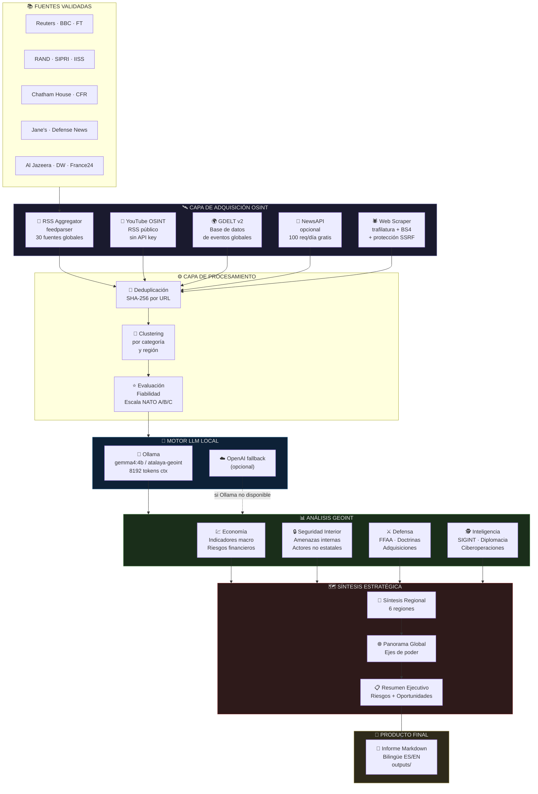
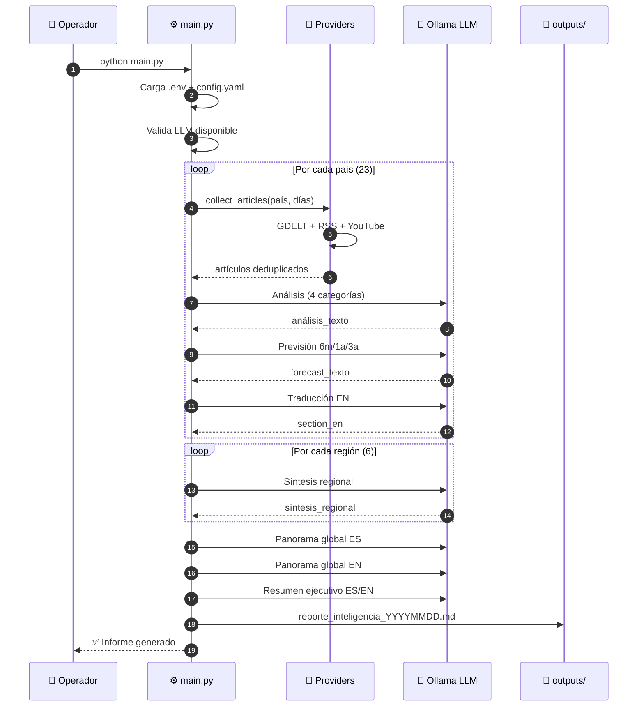
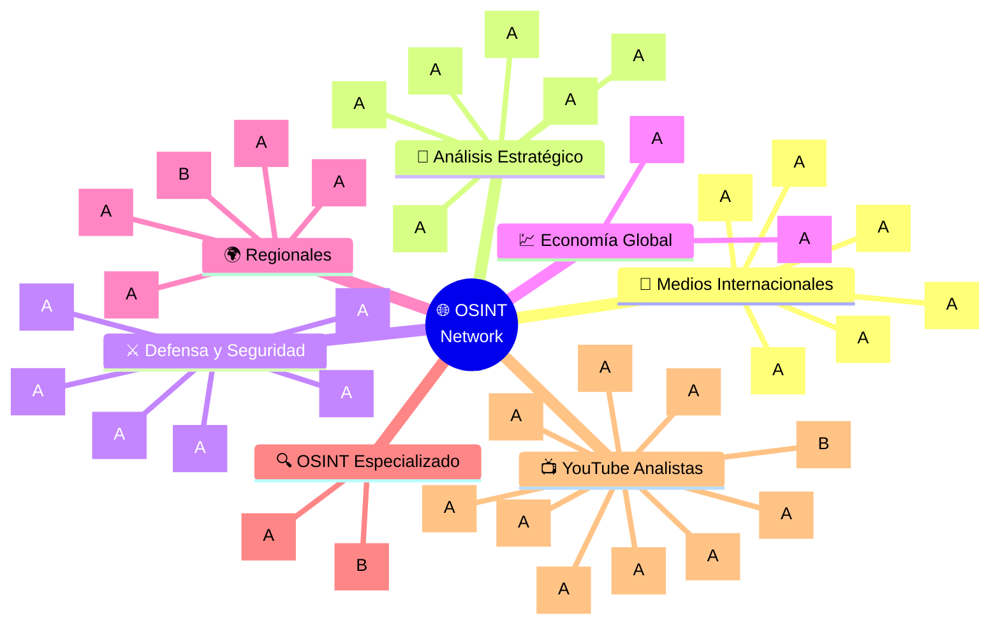
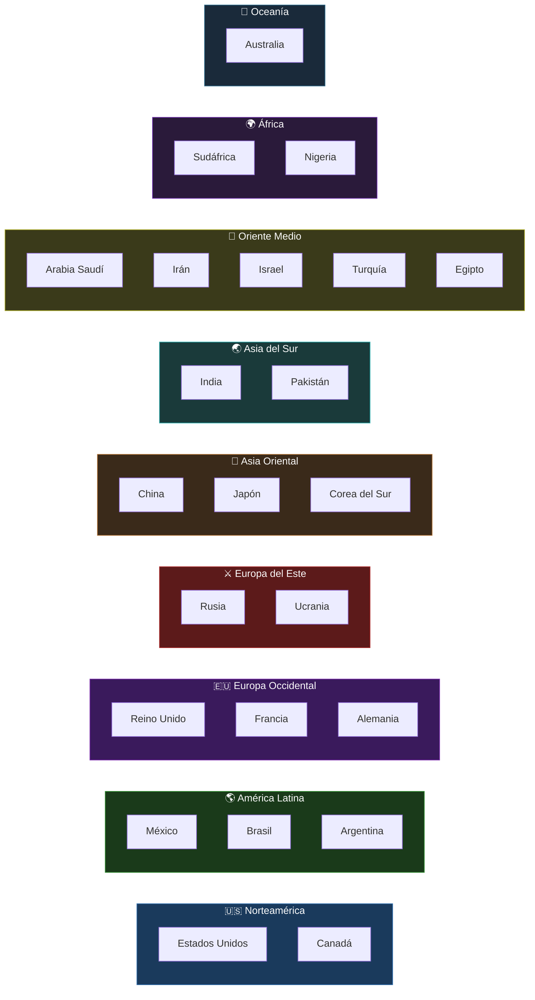
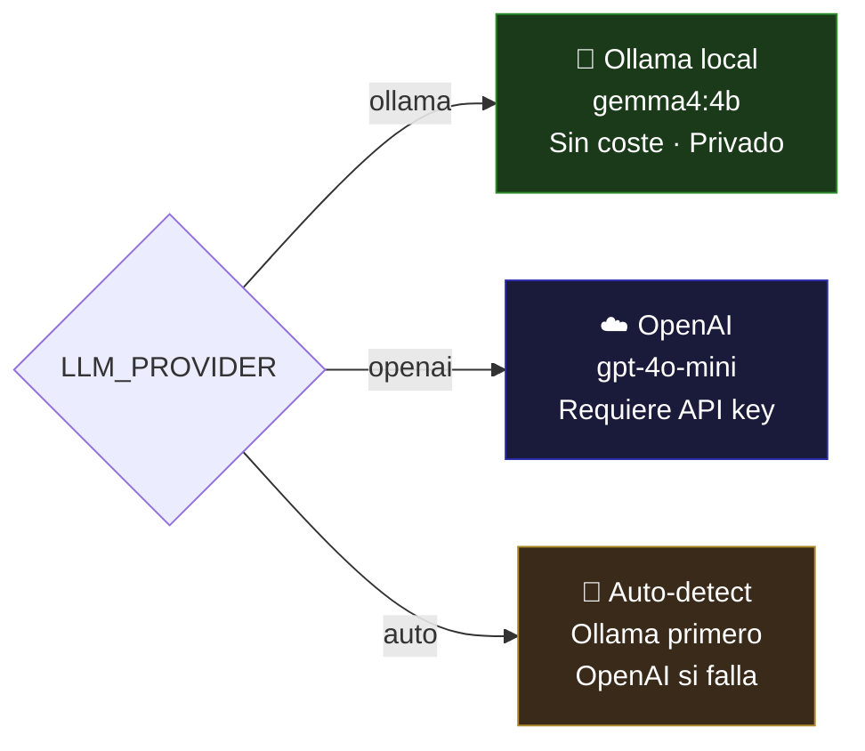
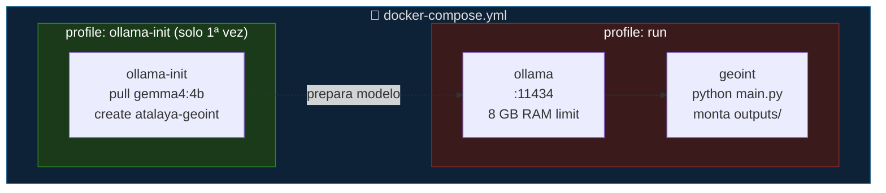
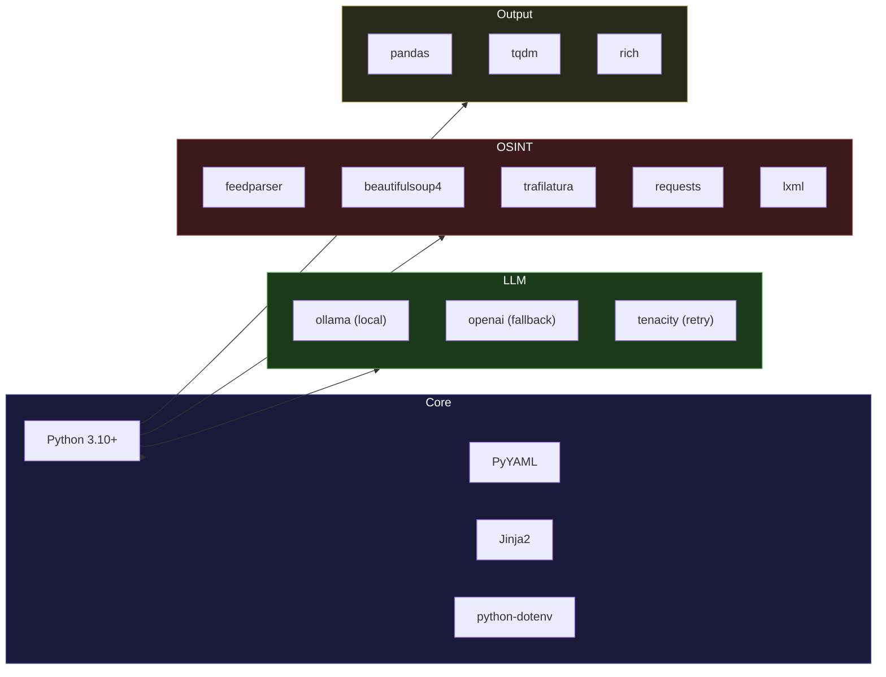

<div align="center">

```
╔══════════════════════════════════════════════════════════════════════════════╗
║                                                                              ║
║   ██╗███╗   ██╗████████╗███████╗██╗     ██╗ ██████╗ ███████╗███╗   ██╗     ║
║   ██║████╗  ██║╚══██╔══╝██╔════╝██║     ██║██╔════╝ ██╔════╝████╗  ██║     ║
║   ██║██╔██╗ ██║   ██║   █████╗  ██║     ██║██║  ███╗█████╗  ██╔██╗ ██║     ║
║   ██║██║╚██╗██║   ██║   ██╔══╝  ██║     ██║██║   ██║██╔══╝  ██║╚██╗██║     ║
║   ██║██║ ╚████║   ██║   ███████╗███████╗██║╚██████╔╝███████╗██║ ╚████║     ║
║   ╚═╝╚═╝  ╚═══╝   ╚═╝   ╚══════╝╚══════╝╚═╝ ╚═════╝ ╚══════╝╚═╝  ╚═══╝     ║
║                                                                              ║
║          ██████╗ ███████╗ ██████╗ ██████╗  ██████╗  ██████╗                ║
║         ██╔════╝ ██╔════╝██╔═══██╗██╔══██╗██╔═══██╗██╔════╝                ║
║         ██║  ███╗█████╗  ██║   ██║██████╔╝██║   ██║██║                     ║
║         ██║   ██║██╔══╝  ██║   ██║██╔═══╝ ██║   ██║██║                     ║
║         ╚██████╔╝███████╗╚██████╔╝██║     ╚██████╔╝╚██████╗                ║
║          ╚═════╝ ╚══════╝ ╚═════╝ ╚═╝      ╚═════╝  ╚═════╝                ║
║                                                                              ║
║            S I S T E M A   D E   I N T E L I G E N C I A                   ║
║               E S T R A T É G I C A   G L O B A L  v2.0                    ║
║                                                                              ║
╚══════════════════════════════════════════════════════════════════════════════╝
```

[](https://opensource.org/licenses/MIT)
[](https://www.python.org/)
[](https://ollama.com/)
[](https://ollama.com/library/gemma4)
[](https://docs.docker.com/compose/)
[](sources/sources.json)
[](/)

> **Sistema autónomo de producción de inteligencia geopolítica semanal.**  
> Opera 100% en local con LLM propio (Ollama/Gemma 4B). Sin dependencias de APIs externas.  
> Recopila fuentes abiertas globales, analiza con metodología PMESII-PT y genera informes  
> clasificados en **Economía · Seguridad · Defensa · Inteligencia**.

</div>

---

## ÍNDICE OPERATIVO

- [Descripción del Sistema](#descripción-del-sistema)
- [Arquitectura](#arquitectura)
- [Pipeline de Producción](#pipeline-de-producción)
- [Red de Fuentes OSINT](#red-de-fuentes-osint)
- [Instalación](#instalación)
- [Configuración](#configuración)
- [Ejecución](#ejecución)
- [Estructura del Proyecto](#estructura-del-proyecto)
- [Formato del Informe](#formato-del-informe)
- [Docker](#docker)
- [Metodología de Inteligencia](#metodología-de-inteligencia)
- [Autor y Contacto](#autor-y-contacto)

---

## Descripción del Sistema

**InteligenciaGeopolitica** es un servidor de inteligencia geopolítica de código abierto diseñado para operar en entornos locales o air-gapped. Monitoriza **23 países** en **6 regiones estratégicas**, agrega información de **30 fuentes RSS** y **10 canales YouTube** de analistas internacionales, y produce semanalmente informes estructurados en español e inglés.

### Capacidades principales

| Capacidad | Descripción |
|-----------|-------------|
| 🤖 **LLM Local** | Motor Gemma 4B vía Ollama — sin API key, sin coste por token |
| 📡 **OSINT RSS** | 30 fuentes globales: Reuters, BBC, RAND, SIPRI, Chatham House, Jane's, FT... |
| 🎥 **YouTube OSINT** | 10 canales de analistas (CSIS, CFR, Stratfor, Al Jazeera, DW...) sin API |
| 🌐 **Web Scraping** | Extracción de contenido completo con trafilatura + BeautifulSoup |
| 📰 **Informe semanal** | Markdown bilingüe (ES/EN) con análisis + previsiones 6m/1a/3a |
| 🛡️ **SSRF protegido** | Bloqueo de IPs privadas en todas las peticiones HTTP |
| 🔁 **OpenAI fallback** | Si Ollama no disponible, usa OpenAI como respaldo opcional |
| 🐳 **Docker-ready** | Stack completo con `docker-compose up` |

---

## Arquitectura



---

## Pipeline de Producción



---

## Red de Fuentes OSINT



### Cobertura geográfica



---

## Instalación

### Opción A — Instalación rápida (recomendada)

```bash
# 1. Clonar repositorio
git clone https://github.com/murdok1982/InteligenciaGeopolitica.git
cd InteligenciaGeopolitica

# 2. Ejecutar instalador automático
# Instala Ollama, descarga gemma4:4b, crea perfil atalaya-geoint, instala pip
chmod +x setup.sh
./setup.sh
```

El script `setup.sh` realiza automáticamente:

```
[1/4] Instalando dependencias Python (requirements.txt)
[2/4] Verificando / instalando Ollama
[3/4] Descargando modelo gemma4:4b (~3.5 GB)
[4/4] Creando perfil atalaya-geoint (Modelfile personalizado)
```

### Opción B — Instalación manual paso a paso

```bash
# 1. Clonar
git clone https://github.com/murdok1982/InteligenciaGeopolitica.git
cd InteligenciaGeopolitica

# 2. Entorno virtual
python3 -m venv venv
source venv/bin/activate        # Linux/Mac
# venv\Scripts\activate         # Windows

# 3. Dependencias
pip install -r requirements.txt

# 4. Instalar Ollama
curl -fsSL https://ollama.com/install.sh | sh

# 5. Descargar modelo base
ollama pull gemma4:4b

# 6. Crear perfil analista militar (opcional pero recomendado)
ollama create atalaya-geoint -f ollama_geoint.modelfile

# 7. Configurar entorno
cp .env.example .env
# Editar .env si es necesario (ver sección Configuración)
```

### Opción C — Docker (sin instalación local)

```bash
git clone https://github.com/murdok1982/InteligenciaGeopolitica.git
cd InteligenciaGeopolitica
cp .env.example .env

# Iniciar Ollama y descargar modelo (solo primera vez)
docker compose --profile ollama-init up

# Ejecutar pipeline
docker compose --profile run up
```

---

### Requisitos del sistema

| Componente | Mínimo | Recomendado |
|-----------|--------|-------------|
| Python | 3.10+ | 3.11+ |
| RAM | 6 GB | 8 GB |
| Almacenamiento | 5 GB | 10 GB |
| CPU | 4 núcleos | 8 núcleos |
| GPU | No requerida | NVIDIA (acelera ×10) |
| SO | Linux / macOS / WSL2 | Ubuntu 22.04 LTS |
| Internet | Requerido para OSINT | — |

> **Modo air-gapped:** una vez instalado Ollama y el modelo, el análisis LLM funciona sin internet. Solo se requiere conectividad para la recopilación de fuentes RSS.

---

## Configuración

El archivo `.env` controla todos los parámetros operativos:

```bash
# ── Motor LLM ─────────────────────────────────────────────────────────────────
LLM_PROVIDER=ollama          # ollama | openai | auto
OLLAMA_BASE_URL=http://localhost:11434
OLLAMA_MODEL=atalaya-geoint  # o gemma4:4b para el modelo base

# ── Fallback OpenAI (opcional) ────────────────────────────────────────────────
# OPENAI_API_KEY=sk-...
# OPENAI_MODEL=gpt-4o-mini

# ── Fuentes de noticias opcionales ───────────────────────────────────────────
# NEWSAPI_KEY=...             # newsapi.org — 100 req/día gratis
```

Parámetros de `config.yaml`:

```yaml
run:
  days_back: 7               # Ventana temporal de análisis (días)
  per_country_limit: 20      # Artículos máx. por país
  providers:                 # Fuentes activas
    - rss                    # 30 feeds RSS globales (sin API)
    - youtube                # 10 canales YouTube (sin API)
    - gdelt                  # Base de datos eventos globales
    # - newsapi              # Requiere NEWSAPI_KEY en .env

llm:
  temperature: 0.3           # Precisión analítica (0.0–1.0)
  max_tokens: 2000

report:
  classification: ABIERTO    # ABIERTO | RESTRINGIDO | CONFIDENCIAL
```

### Modos LLM disponibles



---

## Ejecución

### Generar informe ahora

```bash
# Activar entorno virtual (si no está activo)
source venv/bin/activate

# Ejecutar
python main.py
```

Salida esperada:

```
🔧 Proveedor LLM: OLLAMA | Modelo: atalaya-geoint
📰 Fuentes activas: gdelt, rss, youtube
🌍 Países a analizar: 23
📅 Período: últimos 7 días

🔎 Recolectando y analizando países...
100%|████████████████████████| 23/23 [12:34<00:00, 32.8s/país]

✅ Reporte generado: outputs/reporte_inteligencia_global_20260513_063000.md
```

### Automatización semanal (cron)

```bash
# Ejecutar cada lunes a las 06:00 UTC
crontab -e

# Añadir línea:
0 6 * * 1 cd /ruta/InteligenciaGeopolitica && /ruta/venv/bin/python main.py >> logs/weekly.log 2>&1
```

---

## Estructura del Proyecto

```
InteligenciaGeopolitica/
│
├── main.py                        # 🚀 Pipeline principal
├── config.yaml                    # ⚙️ Configuración global
├── setup.sh                       # 🛠️ Instalador one-click
├── Dockerfile                     # 🐳 Imagen Docker
├── docker-compose.yml             # 🐳 Stack completo con Ollama
├── ollama_geoint.modelfile        # 🧠 Perfil analista militar
├── requirements.txt               # 📦 Dependencias Python
├── .env.example                   # 🔑 Plantilla de variables
│
├── providers/                     # 📡 Módulos de adquisición
│   ├── gdelt_provider.py          #   └─ GDELT v2 (eventos globales)
│   ├── newsapi_provider.py        #   └─ NewsAPI (opcional)
│   ├── rss_provider.py            #   └─ 30 fuentes RSS (sin API)
│   └── youtube_provider.py        #   └─ 10 canales YouTube (sin API)
│
├── utils/                         # 🔧 Utilidades del sistema
│   ├── llm.py                     #   └─ Adaptador LLM (Ollama/OpenAI)
│   ├── scraper.py                 #   └─ Extracción web + SSRF guard
│   ├── io.py                      #   └─ E/S de archivos y config
│   └── regions.py                 #   └─ Mapeo de países a regiones
│
├── sources/                       # 📚 Base de datos de fuentes
│   └── sources.json               #   └─ 30 RSS + 10 YouTube validados
│
├── prompts/                       # 📝 Plantillas de análisis
│   ├── analysis_es.txt            #   └─ Análisis por país (4 dimensiones)
│   ├── forecast_es.txt            #   └─ Previsión 6m/1a/3a
│   ├── synthesis_es.txt           #   └─ Síntesis regional
│   └── report_bilingual.txt       #   └─ Plantilla informe final
│
└── outputs/                       # 📄 Informes generados
    └── reporte_inteligencia_*.md
```

---

## Formato del Informe

Cada informe generado sigue la siguiente estructura clasificada:

```
╔══════════════════════════════════════════════════════════╗
║  INFORME DE INTELIGENCIA ESTRATÉGICA GLOBAL              ║
║  Clasificación: ABIERTO | Período: últimos 7 días        ║
║  Motor: OLLAMA / atalaya-geoint                          ║
╠══════════════════════════════════════════════════════════╣
║                                                          ║
║  VERSIÓN ESPAÑOL                                         ║
║  ├── Resumen Ejecutivo (10-14 líneas + riesgos/oport.)   ║
║  ├── Síntesis Regional (6 regiones)                      ║
║  ├── Análisis por País (23 países)                       ║
║  │   ├── Economía                                        ║
║  │   ├── Seguridad Interior                              ║
║  │   ├── Defensa                                         ║
║  │   ├── Inteligencia & Diplomacia                       ║
║  │   └── Previsión 6m / 1a / 3a                          ║
║  └── Panorama Global y Previsiones                       ║
║                                                          ║
║  ENGLISH VERSION                                         ║
║  ├── Executive Summary                                   ║
║  ├── Regional Synthesis                                  ║
║  ├── Country Analysis (23 countries)                     ║
║  └── Global Outlook & Forecasts                          ║
╚══════════════════════════════════════════════════════════╝
```

---

## Docker

### Servicios del stack



```bash
# Primera vez — descarga modelo (~3.5 GB, esperar ~10 min)
docker compose --profile ollama-init up

# Ejecuciones sucesivas
docker compose --profile run up

# Solo Ollama (para pruebas interactivas)
docker compose up ollama -d
ollama run atalaya-geoint
```

---

## Metodología de Inteligencia

### Marco PMESII-PT

El perfil `atalaya-geoint` instruye al modelo para aplicar el marco analítico estándar NATO:

```
┌──────────────────────────────────────────────────────────────────┐
│                     MODELO PMESII-PT                             │
├──────────┬───────────────────────────────────────────────────────┤
│ P        │ Político — gobierno, actores, estabilidad             │
│ M        │ Militar — FFAA, doctrina, capacidades                 │
│ E        │ Económico — PIB, comercio, sanciones, deuda           │
│ S        │ Social — demografía, tensiones, cohesión              │
│ I        │ Infraestructura — energía, telecomunicaciones         │
│ I        │ Información — medios, narrativas, desinformación      │
├──────────┼───────────────────────────────────────────────────────┤
│ P        │ Tiempo (Physical Time) — contexto histórico           │
│ T        │ Terreno físico — geografía estratégica                │
└──────────┴───────────────────────────────────────────────────────┘
```

### Escala de fiabilidad de fuentes (NATO)

```
┌───────┬──────────────────────────────────────────────────────────┐
│ Cód.  │ Descripción                           │ Ejemplos          │
├───────┼───────────────────────────────────────┼───────────────────┤
│  A    │ Completamente fiable                  │ Reuters, BBC, FT  │
│  B    │ Generalmente fiable                   │ Bellingcat, MEE   │
│  C    │ Moderadamente fiable                  │ RT, Xinhua, TASS  │
│  D    │ Normalmente no fiable                 │ Blogs, forums     │
│  E    │ No fiable                             │ Fuentes anónimas  │
│  F    │ Fiabilidad no evaluable               │ Sin contrastar    │
├───────┼───────────────────────────────────────┼───────────────────┤
│  1    │ Confirmado por otras fuentes          │                   │
│  2    │ Posiblemente verdadero                │                   │
│  3    │ Quizás verdadero                      │                   │
│  4    │ Dudoso                                │                   │
│  5    │ Improbable                            │                   │
│  6    │ Sin evaluación                        │                   │
└───────┴───────────────────────────────────────┴───────────────────┘
```

---

## Dependencias



---

## Seguridad

- **Sin API keys obligatorias** — Ollama corre completamente en local
- **Protección SSRF** — todas las peticiones HTTP bloquean rangos de IP privados (RFC 1918)
- **Sin telemetría** — cero datos enviados a terceros en modo Ollama
- **Air-gap compatible** — tras instalación inicial funciona sin internet (solo OSINT requiere red)
- **Logs sin secretos** — no se imprime ninguna clave en consola

---

## 💰 Apoyar el Proyecto

<div align="center">

### ₿ Donaciones Bitcoin

```
┌─────────────────────────────────────────┐
│         ₿  BTC Donation Address  ₿      │
├─────────────────────────────────────────┤
│                                         │
│  bc1qqphwht25vjzlptwzjyjt3sex           │
│  7e3p8twn390fkw                         │
│                                         │
│  Red: Bitcoin (BTC) — mainnet           │
└─────────────────────────────────────────┘
```


**`bc1qqphwht25vjzlptwzjyjt3sex7e3p8twn390fkw`**

*Tu apoyo financia investigación de inteligencia de código abierto* 🙏

</div>

---

## Autor y Contacto

**murdok1982 — Gustavo Lobato Clara**

- GitHub: [@murdok1982](https://github.com/murdok1982)
- LinkedIn: [Gustavo Lobato Clara](https://www.linkedin.com/in/gustavo-lobato-clara-2b446b102/)
- Email: gustavolobatoclara@gmail.com

---

## Centro de Comunicaciones

<details>
<summary><b>🚨 Reportar incidencia operativa</b></summary>
<br>
Envía a <b>gustavolobatoclara@gmail.com</b> con asunto: <code>[INCIDENCIA] InteligenciaGeopolitica — descripción</code>
<ol>
  <li>Describe la incidencia y su impacto operativo</li>
  <li>Adjunta logs o capturas relevantes</li>
  <li>Indica entorno (OS, versión Python, modelo LLM)</li>
</ol>
</details>

<details>
<summary><b>🛠️ Reportar fallo de instalación / compilación</b></summary>
<br>
Envía a <b>gustavolobatoclara@gmail.com</b> con asunto: <code>[BUILD] EntornoOS — descripción del fallo</code>
<ol>
  <li>SO y versión de Python</li>
  <li>Traza de error completa (terminal)</li>
  <li>Secuencia de comandos ejecutados</li>
</ol>
</details>

<details>
<summary><b>💡 Proponer mejora o nuevo módulo</b></summary>
<br>
Envía a <b>gustavolobatoclara@gmail.com</b> con asunto: <code>[PROPUESTA] Nombre de la mejora</code>
<ol>
  <li>Objetivo táctico / problema que resuelve</li>
  <li>Enfoque técnico propuesto</li>
  <li>Impacto esperado en la calidad del producto de inteligencia</li>
</ol>
</details>

---

## Licencia

MIT License — ver [LICENSE](LICENSE)

---

<div align="center">

```
╔══════════════════════════════════════════════════════╗
║     SISTEMA CLASIFICADO — USO ANALÍTICO              ║
║     Producto de inteligencia de fuentes abiertas     ║
║     Requiere validación humana antes de uso          ║
║     operativo. No sustituye análisis experto.        ║
╚══════════════════════════════════════════════════════╝
```

⭐ **[Star este repo](https://github.com/murdok1982/InteligenciaGeopolitica)** si te resulta útil  
🐛 **[Reportar issues](https://github.com/murdok1982/InteligenciaGeopolitica/issues)**

**_STAY INFORMED · STAY AHEAD_** 🌍

</div>

---

## Support / Apoya este proyecto

I build open-source projects focused on applied AI, automation, and data intelligence.
Over on my GitHub you'll find things like AI-powered analysis engines, OSINT platforms for open-source research, Windows automation tools, and experiments with language models.
Everything is public and free, so anyone can use it, study it, or build on top of it. github.com/murdok1982

Keeping these projects alive takes a lot of hours. If any of them have helped you out or you just like what I'm doing, you can support me with a coffee: ko-fi.com/murdok1982

Every contribution goes straight back into shipping more open-source code.
